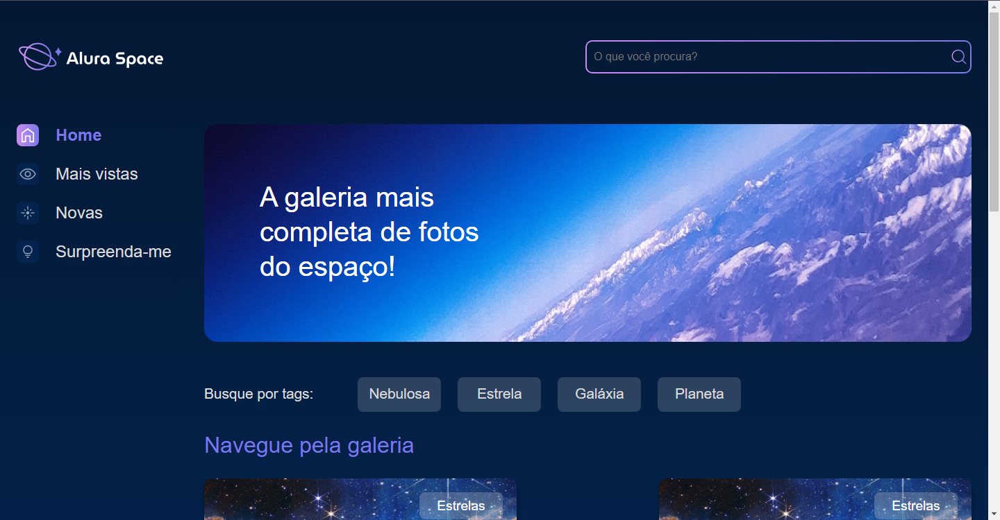

<h1 align="center"> Alura Space </h1>

Projeto realizado visando agregar conhecimento em relação ao Django. Baseado no curso "Django: templates e boas práticas" da Alura.

  <a href="#-tecnologias">Tecnologias</a>&nbsp;&nbsp;&nbsp;|&nbsp;&nbsp;&nbsp;
  <a href="#-projeto">Projeto</a>&nbsp;&nbsp;&nbsp;|&nbsp;&nbsp;&nbsp;
  <a href="#-layout">Layout</a>&nbsp;&nbsp;&nbsp;|&nbsp;&nbsp;&nbsp;
  <a href="#memo-licença">Licença</a>

  

 

  

## 🚀 Tecnologias

Esse projeto foi desenvolvido com as seguintes tecnologias:

- HTML e CSS
- JS
- Python e Django
- Git e Github

## 💻 Projeto

Neste projeto foi criado, junto ao professor Guilherme Lira o site da Alura Space. Este site foi criado de forma que o professor, através da construção da página, conseguisse passsar fundamentos de boas práticas de como utilizar o Django.

## :memo: Licença

Esse projeto está sob a licença MIT.

---

Feito com ♥ by Arthur Oliveira